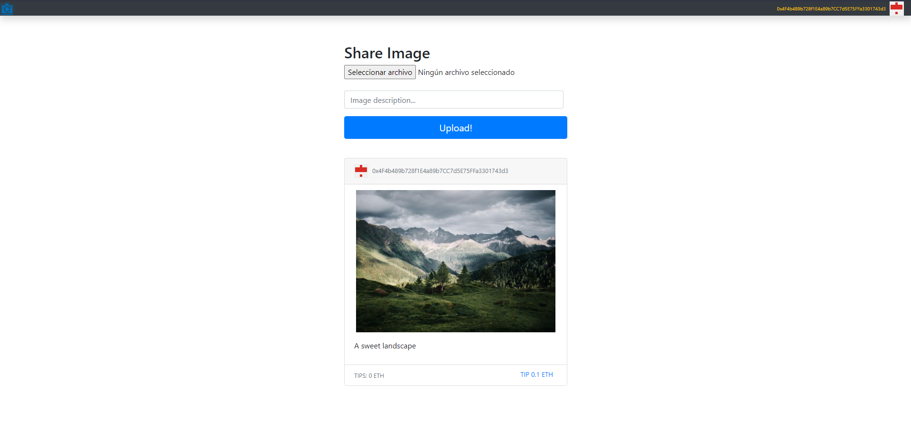

# Decentragram

An instagram clone that allows eth tiping to the post authors, made with blockchain, ethereum, solidity, web3, IPFS, truffle, ganache and react.

Meant to learn blockchain technologies.

## 🔧 Project Diagram:

## How to run.

1) Install the following dependencies: Node, truffle, ganache.
2) Make sure your `truffle-config.js` is setted up with your Ganache network.
3) Execute the command: `npm i`
4) Execute the command: `truffle migrate --reset`
5) Execute the command: `npm start`

## Testing.

- Execute the command `truffle test` to run the tests.
